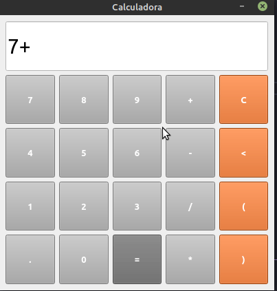
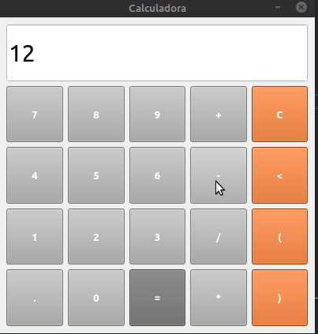
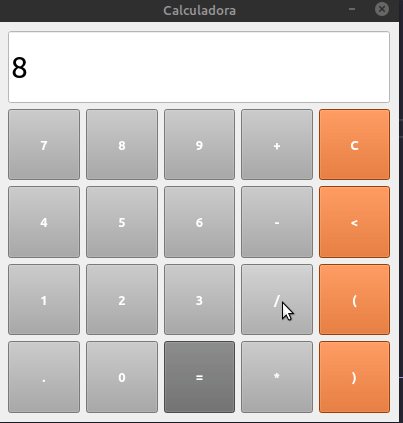
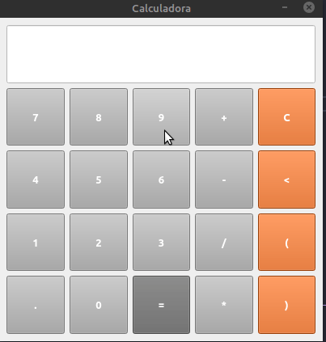
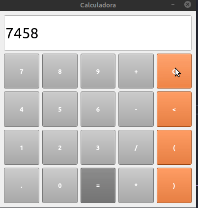

# Calculadora
  Nesse projeto foi usar o pyQT5 sem o auxilio do QT designer
  
 # Instalção pyQT5
 
   `pip install PyQt5`
  
  # Funcionamento
   Basicamente o funcionamento é como um calculadora comum. Ela realizar todas as somas que o Python pode realizar, por Exemplo em Python
   para realizar a potencia de um numero utilizamos ** . Então se utilizamos ** na calculadora ele ira realizar o calculo da potencia de uma numero.
   
   ## Fucionalidades
   
   ### Soma
   
   
   ### Subtração
   
   
   ### Multiplicação
   
   
   ### Divisão
   
   
   ### Potencia
   
   
   ### Apagar individualmente
   

   ### Apagar tudo
   
